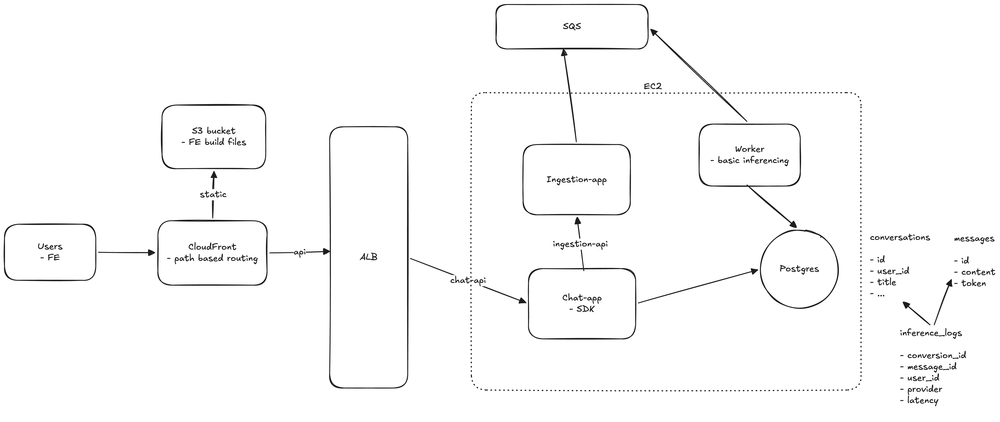
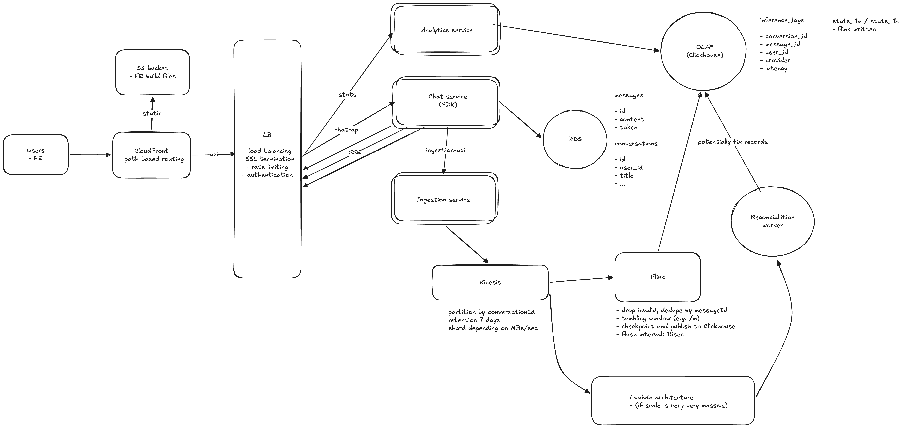

# Architecture Notes

Brief reference for how the system works today:

- [Ingestion flow](#ingestion-flow) — async path from SDK to Postgres via SQS
- [Logging strategy](#logging-strategy) — why chat and observability are separate, and what we store
- [Scaling considerations](#scaling-considerations) — one-box prod today vs scaled target layout
- [Failure handling assumptions](#failure-handling-assumptions) — per-component recovery and infra blast radius

## System diagram

**Current (low scale)** — one EC2 box for all backend services:

**At scale** — see [Scaling considerations → At scale](#at-scale) and [`docs/scaled-hld.png`](docs/scaled-hld.png).

### Monorepo layout

| Path | Role |
|------|------|
| `frontend/` | Chat UI and metrics dashboard |
| `backend/apps/chat-api` | Conversations, streaming chat (SSE), stats API |
| `backend/apps/ingestion-api` | Validates payloads, enqueues to SQS |
| `backend/apps/worker` | Long-polls SQS, batch-inserts `InferenceLog` |
| `packages/sdk` | Provider abstraction + async log dispatcher |
| `packages/shared` | Zod schemas and shared types |
| `packages/db` | Prisma schema and client |

---

## Ingestion flow

Inference logs are emitted after each LLM call and persisted asynchronously: chat-api never waits on the queue or log table. Chat data still writes to Postgres synchronously on the hot path.

End-to-end path for a single inference log:

1. **Emit** — After an LLM stream completes (or errors), `LLMClient` in `@llm-logger/sdk` builds an `InferenceLogPayload` (provider, model, latency, token usage, previews, context metadata) and hands it to `LogDispatcher`.
2. **Deliver** — The dispatcher `POST`s JSON to `ingestion-api` at `/api/logs`. Delivery is **non-blocking** from the chat caller’s perspective: `send()` returns immediately and retries run in the background (default: 3 retries, exponential backoff from 200ms).
3. **Validate & enqueue** — `ingestion-api` parses the body with `inferenceLogPayloadSchema` (Zod). On success it calls `SqsPublisher.publish()`, which `SendMessage`s the payload to the configured queue. The HTTP response is **202 Accepted** with `{ enqueued: true, messageId }`.
4. **Consume** — `worker` long-polls SQS (`ReceiveMessage`, up to `BATCH_SIZE` messages, default 10, `WAIT_TIME_SECONDS` default 20). Each message body is JSON-parsed and validated again with the same Zod schema.
5. **Persist** — Valid rows are inserted via `prisma.inferenceLog.createMany({ skipDuplicates: true })`. Successfully processed messages (and permanently invalid ones) are removed with `DeleteMessageBatch`.
6. **Read** — The dashboard and `GET /api/stats` on **chat-api** query `InferenceLog` in Postgres. There is **eventual consistency**: a completed chat may appear in the UI before its log shows on the dashboard.

Chat messages and conversations are written **synchronously** by **chat-api** to Postgres; only observability data uses the async pipeline above.

---

## Logging strategy

Observability is a **side channel**: same Zod contract end-to-end, **best-effort** delivery, payloads sized for operations—not a second copy of the chat thread. The async path is [Ingestion flow](#ingestion-flow); table shapes, previews, indexes, and chat-vs-log split are in [README → Schema design](./README.md#schema-design-decisions).

### Runtime behavior

- **Chat path** — Messages and SSE complete without waiting on SQS or `InferenceLog` inserts.
- **Log path** — After each LLM call, the SDK emits an `InferenceLogPayload`; delivery is fire-and-forget to ingestion-api, then queue, then worker (see [Failure handling](#failure-handling-assumptions) for retries and drops).
- **Contract** — `InferenceLogPayload` in `@llm-logger/shared`; SDK, ingestion-api, and worker all validate with `inferenceLogPayloadSchema` so enqueue and persist shapes cannot drift.
- **Guarantee** — Logging is not guaranteed. Chat availability wins; drops are logged server-side (Pino), not surfaced to the client.

---

## Scaling considerations

For **start and low scale**, running everything in **one box** is intentional: one EC2 runs chat-api, ingestion-api, worker, and Postgres via Docker Compose ([`deploy/docker-compose.prod.yml`](deploy/docker-compose.prod.yml)). The repo is multi-service; production is a **modular monolith on one VM** — simple to deploy and debug, with a shared blast radius (CPU, disk, Postgres) that is acceptable while traffic is small.

The live layout is in the [system diagram](#system-diagram) ([`docs/current-hld.png`](docs/current-hld.png)): **S3 + CloudFront** for the UI; **CloudFront `/api` → ALB → chat-api `:3001`** (one EC2 target); **SQS** off-box for the log pipeline; ingestion and worker reachable only on the Compose network.

| Piece | Today |
|-------|--------|
| **Edge** | ALB terminates HTTPS and health-checks chat-api; it does **not** spread load yet (single target). EC2 SG allows inbound only from the ALB. |
| **Backend** | Four containers on one host; `chat-api` → `http://ingestion-api:3002`; one worker consumer |
| **Data** | Postgres on the same host holds chat **and** `inference_logs`; dashboard stats scan that table |
| **First limits** | Host resources, OLTP vs stats contention on Postgres, one worker, LLM provider rate limits |

### At scale

When volume or dashboard load grows, separate OLTP, ingestion throughput, and analytics. Motivation for moving stats off Postgres (current `/api/stats` bottlenecks) is in [README → What I would improve](./README.md#what-i-would-improve-with-more-time).

**Target layout**

- **Edge** — **CloudFront** + **S3** for the static frontend; **ALB** routes chat/SSE to **chat-api** on **ECS** and stats to a dedicated analytics service.
- **OLTP** — **RDS (Postgres)** for conversations and messages only.
- **Ingestion** — **ingestion-api** → **Kinesis**, partitioned by `conversationId`, instead of demo-scale SQS on one host.
- **Stream processing** — **Apache Flink**: validate, dedup by `messageId`, tumbling windows, checkpointing, batched writes to **ClickHouse** (including pre-aggregated `stats_1m` / `stats_1h`).
- **Very high scale** — Optional **Lambda** processors and a **reconciliation worker** to backfill or correct OLAP rows.
- **Dashboard** — Stats API reads **ClickHouse**, not repeated scans of `inference_logs` in Postgres.

---

## Failure handling assumptions

Per-service behavior when something breaks: what we retry, drop, or accept. **Chat availability beats log durability** — not an SLA. Design-level tradeoffs (async path, best-effort logging, demo tenancy) are in [README → Tradeoffs](./README.md#tradeoffs-made). Host-level risks (EC2 down, ALB unhealthy, on-box Postgres outage) follow from [one-box deployment](#scaling-considerations).

---

### SDK dispatcher (`packages/sdk/src/dispatcher.ts`)

**Assumed to fail sometimes:** network blips, ingestion-api 5xx, process restarts mid-request.

**Assumed rare / not worth retrying:** bad payloads (4xx from ingestion-api).

| If this happens | Handling |
|-----------------|----------|
| HTTP 2xx | Done — treat as handed off |
| HTTP 4xx | Log warning, **drop** (no retry) |
| HTTP 5xx or network error | Up to 3 retries, exponential backoff from 200ms, then **drop** |
| Sync throw from `send()` | Caught in `LLMClient.finalize()` — chat still returns |

**Explicitly not handled:** proving the log reached Postgres; surfacing drop counts to the client; distinguishing 429 from 400 (any 4xx is dropped).

---

### Ingestion API (`POST /api/logs`)

**Assumed to fail sometimes:** SQS throttling/outage (`SendMessage` throws).

**Assumed the caller validates shape** before send (worker re-validates anyway).

| If this happens | Handling |
|-----------------|----------|
| Invalid JSON / Zod | **400**, nothing enqueued |
| SQS publish error | **500** `enqueue_failed` — dispatcher may retry |
| Crash after **202** but before `SendMessage` completes | Message never hits queue — **lost**, no outbox |

**Explicitly not handled:** transactional “accept only if enqueued”; idempotency keys; dedup at enqueue time.

---

### Worker + SQS (`backend/apps/worker/src/consumer.ts`)

**Assumed:** SQS redelivery after visibility timeout (30s); duplicate messages on retry.

| If this happens | Handling |
|-----------------|----------|
| Malformed JSON or failed Zod | Warn, **delete** from queue (won’t ever insert) |
| `createMany` fails | **Don’t delete** — message comes back after visibility timeout |
| `DeleteMessageBatch` fails | Warn — message redelivered (possible duplicate insert; `skipDuplicates`) |
| Poll loop throws | Log error, sleep 1s, continue |
| Duplicate `messageId` | `skipDuplicates: true` on insert |

**Explicitly not handled:** DLQ for repeated DB failures; replay UI; alerting on poison rate. Messages missing `Body`/`ReceiptHandle` are skipped in the loop (not deleted) and will redeliver.

---

### Chat API vs logging (`backend/apps/chat-api/src/routes/chat.ts`)

**Assumed:** Users care that messages saved and the stream finishes; dashboard gaps are secondary.

| If this happens | Handling |
|-----------------|----------|
| Ingestion / worker / SQS down | Chat + `Message` writes still run; stats/dashboard miss or delay |
| Provider error inside `finalize()` | Log row with `status: error` still dispatched |
| **Stream throws while iterating deltas** | SSE `error` + early `return` — **`finalize()` never runs → no log** |
| Client disconnects mid-stream | Same risk if the handler exits before `finalize()` |

**Explicitly not handled:** guaranteed log per user message; tying log write to assistant `Message` insert in one transaction.

---

For setup and schema rationale, see [README.md](./README.md).
